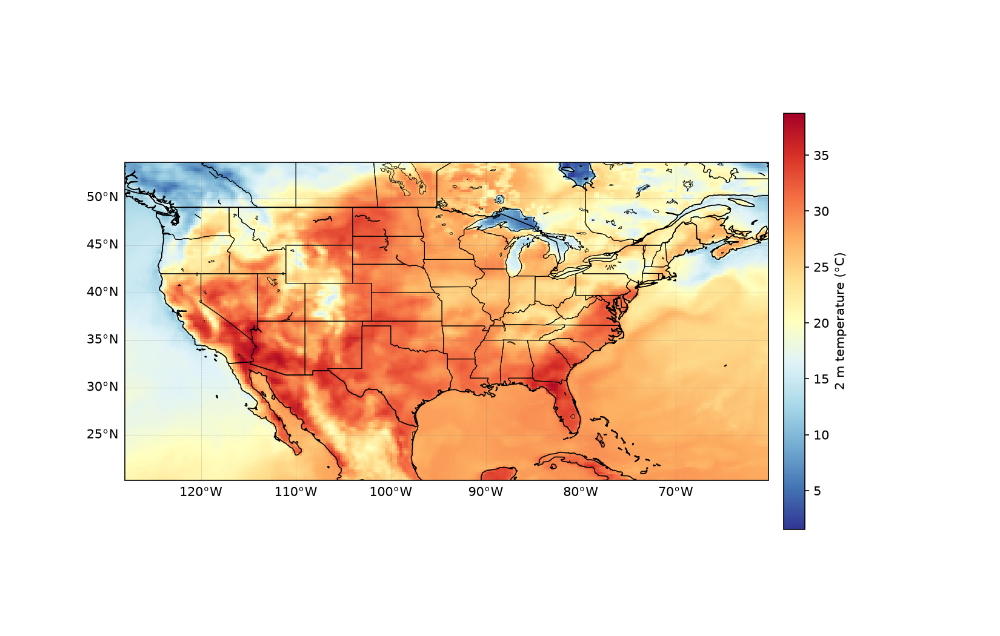
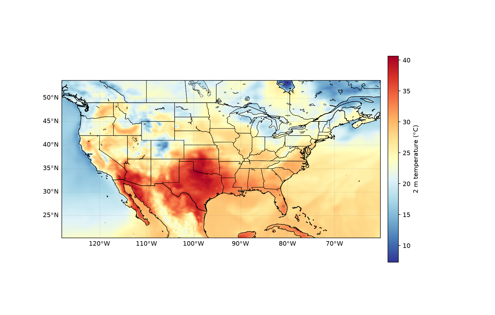
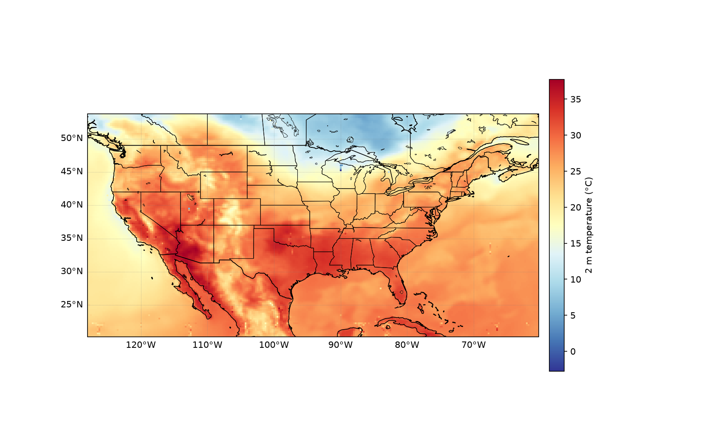

# Test-plotting

Plot **2 m temperature** (`t2`) over CONUS from a NetCDF file, with CONUS,
state, and coastline boundaries overlaid.

The plotting script reads the data and its coordinates **exactly as stored**
(longitudes stay in the 0–360 convention — nothing is shifted or reprojected).
The map's boundary features are aligned to the data via the map projection's
central longitude, so no coordinate of the data or of the boundaries we use is
moved.



## Data

The script expects a NetCDF file with this structure (from `ncdump -h`):

```
dimensions: time(91), member(1), lat(135), lon(272)
variables:
    float t2(time, member, lat, lon)  ; t2:description = "2m temperature" ; t2:units = "K"
    float lat(lat)                    ; 53.75 .. 20.25
    float lon(lon)                    ; 232 .. ~299.75   (0-360 convention)
```

The default filename is `t2_20200627T18_mem49_CONUS.nc`. The `.nc` data file
is **not** committed to the repo (see `.gitignore`); place your file in the
repo directory or pass `--file /path/to/file.nc`.

## Installation (conda)

### Option A — create the environment from `environment.yml`

```bash
conda env create -f environment.yml
conda activate aeris-plot
```

### Option B — install just the libraries into a new environment

```bash
conda create -n aeris-plot -c conda-forge python=3.11 \
    numpy xarray netcdf4 matplotlib cartopy pillow
conda activate aeris-plot
```

That's everything the script needs: `numpy`, `xarray`, `netcdf4`,
`matplotlib`, and `cartopy` (`pillow` is optional, only for inspecting PNGs).

> The first run downloads Natural Earth boundary shapefiles (states, borders,
> coastline, lakes) via cartopy — this needs an internet connection once.

## Usage

```bash
# First time step, member 0, temperature in °C -> t2_conus.png
python plot_t2_conus.py

# A later time step
python plot_t2_conus.py --time 30 --out figures/t2_conus_t030.png

# Point at a different file and choose units (K, C, or F)
python plot_t2_conus.py --file my_run.nc --time 10 --units C --out my_map.png
```

### Command-line options

| Option      | Default                            | Description                          |
|-------------|------------------------------------|--------------------------------------|
| `--file`    | `t2_20200627T18_mem49_CONUS.nc`    | Path to the NetCDF file              |
| `--time`    | `0`                                | Time index (0-based)                 |
| `--member`  | `0`                                | Ensemble member index (0-based)      |
| `--units`   | `C`                                | Output units: `K`, `C`, or `F`       |
| `--cmap`    | `RdYlBu_r`                         | Matplotlib colormap                  |
| `--out`     | `t2_conus.png`                     | Output image filename                |
| `--dpi`     | `150`                              | Output resolution                    |

## Sample figures

| Time index 0 | Time index 30 | Time index 60 |
|:---:|:---:|:---:|
|  |  |  |

All three are 2 m temperature in °C over CONUS, member 0, at different lead
times in the file.
